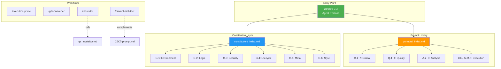

# Development Rules Architecture

> **"Titanium Strategist" 開発ルールシステムの全体構造**
>
> 最終更新: 2026-01-09

---

## Directory Structure

```
開発（太郎）/
├── dev-rules/                    # 🛡️ Development Constitution & Prompts
│   ├── GEMINI.md                 # Entry Point - Agent Persona
│   ├── ARCHITECTURE.md           # This file
│   ├── MANUAL.md                 # Integrated User Manual
│   │
│   ├── constitution/             # 🔒 Immutable Rules (6 Layers)
│   │   ├── _index.md             # Layer Reference
│   │   ├── 00_orchestration.md   # Core: State, Modes
│   │   ├── 01_environment.md     # G-1: DMZ, Directory Lock
│   │   ├── 02_logic.md           # G-2: TDD, Complexity Budget
│   │   ├── 03_security.md        # G-3: Red Teaming, Chaos Monkey
│   │   ├── 04_lifecycle.md       # G-4: Ripple Effect, Rollback
│   │   ├── 05_meta_cognition.md  # G-5: Devil's Advocate
│   │   └── 06_style.md           # G-6: Code DNA, Naming
│   │
│   └── prompts/                  # 📦 Reusable Modules (19+)
│       ├── _index.md             # Module Reference
│       ├── modules/              # Categorized Prompts
│       │   ├── C*-*.md           # Critical (Audit/Fix)
│       │   ├── Q*-*.md           # Quality
│       │   ├── A*-*.md           # Analysis
│       │   └── ...               # Execution, Review, Meta
│       └── system/               # System Instructions
│           ├── cold_mirror.md
│           └── qa_inquisitor.md  # ← Canonical Inquisitor
│
└── .agent/workflows/             # ⚡ Antigravity Slash Commands
    ├── /execution-prime          # System Instructions Generator
    ├── /gdr-converter            # Deep Research Report Converter
    ├── /inquisitor               # → refs: prompts/system/qa_inquisitor.md
    └── /prompt-architect         # Prompt Module Auditor
```

---

## Component Relationships



---

## Loading Strategy (Phase-Aware)

| Phase | Trigger | Load Modules |
|---|---|---|
| **Ideation** | ブレスト、「どう思う？」 | G-5 Meta |
| **Requirements** | 要件定義、仕様確認 | G-5, M-05 Domain |
| **Planning** | 設計、アーキテクチャ | G-1, G-4, M-10 Ripple |
| **Implementation** | コード生成、実装 | G-1, G-2, G-3 |
| **Review** | 監査、セキュリティ | G-3, G-5 |
| **Documentation** | コミット、リリース | G-4 |

---

## Workflow Quick Reference

| Slash Command | Purpose | Canonical Source |
|---|---|---|
| `/execution-prime` | System Instructions を生成 | Self-contained |
| `/gdr-converter` | Deep Research → Knowledge Artifact 変換 | Self-contained |
| `/inquisitor` | 品質審問（チャット履歴 vs 指示書） | `prompts/system/qa_inquisitor.md` |
| `/prompt-architect` | プロンプトモジュールの監査・改善 | Self-contained |

---

## Tiered Loading Architecture (v3.0)

```
┌─────────────────────────────────────────────────────────────┐
│  Tier 0: KERNEL (常時ロード / ~500 tokens)                  │
│  ─────────────────────────────────────────────────────────  │
│  • GEMINI.md (圧縮版)                                       │
│  • 3原則: Guard / Prove / Undo                              │
│  • Mandatory Modules (M-01, M-07, M-25)                     │
└─────────────────────────────────────────────────────────────┘
                          ↓
┌─────────────────────────────────────────────────────────────┐
│  Tier 1: PHASE-TRIGGERED (フェーズ検知で自動ロード)         │
│  ─────────────────────────────────────────────────────────  │
│  Planning → G-1, G-4  |  Implementation → G-2, G-3         │
└─────────────────────────────────────────────────────────────┘
                          ↓
┌─────────────────────────────────────────────────────────────┐
│  Tier 2: ON-DEMAND (/load で明示ロード)                     │
│  ─────────────────────────────────────────────────────────  │
│  /load G-3  |  /load C-4  |  /load G-1 G-2                  │
└─────────────────────────────────────────────────────────────┘
```

---

## Enforcement Levels

| Level | 名称 | 強制力 | Override |
|:---:|---|---|---|
| **L0** | Immutable | 絶対 | 不可 |
| **L1** | Enforced | 原則遵守 | SUDO_OVERRIDE で一時停止可 |
| **L2** | Recommended | 推奨 | 理由を明示すればスキップ可 |
| **L3** | Optional | 参考 | 任意適用 |

### Module → Level Mapping

| Module | Level |
|---|---|
| Orchestrator, G-5 (M-07) | L0 |
| G-1, G-2, G-3 | L1 |
| G-4, G-6 | L2 |
| M-19 (Container First) | L3 |

---

## Version History

| Date | Version | Changes |
|---|---|---|
| 2026-01-09 | 2.0.0 | Tiered Loading Architecture, Enforcement Levels 追加 |
| 2026-01-09 | 1.0.0 | Initial architecture documentation |
