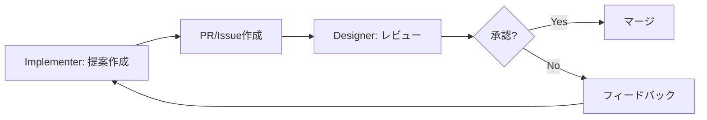

# Access Control Policy

> **「Titanium Strategist」開発チームの権限・ファイル共有ルール**
>
> 最終更新: 2026-01-10

---

## 🎭 ロール定義

| ロール | 別名 | 責務 |
|--------|------|------|
| **設計指示担当 (Designer)** | Architect / CEO | 戦略・方針決定、Constitution管理、プロンプト設計 |
| **実装指示担当 (Implementer)** | Constructor / 現場監督 | コード実装、日記作成、テスト実行 |

---

## 📊 権限マトリクス

| ディレクトリ/ファイル | Designer | Implementer | 備考 |
|----------------------|:--------:|:-----------:|------|
| `GEMINI.md`, `GEMINI_FULL.md` | ✅ RW | 🔒 R | AIペルソナ（変更禁止） |
| `ARCHITECTURE.md` | ✅ RW | 🔒 R | 構造変更は設計担当のみ |
| `MANUAL.md` | ✅ RW | 🔒 R | 統合マニュアル |
| `constitution/` | ✅ RW | 🔒 R | 不変ルール層（L0-L1） |
| `prompts/` | ✅ RW | 📝 Propose | 提案可、マージは設計担当 |
| `docs/` | ✅ RW | ✅ RW | 両者編集可 |
| `src/` | 📝 Review | ✅ RW | 実装担当がメイン |
| `tests/` | 📝 Review | ✅ RW | 実装担当がメイン |
| `dev_tools/` | ✅ RW | ✅ RW | 開発ツール |
| `diary/` | ✅ RW | ✅ RW | 両者が日記を記録 |
| `shared/knowledge/` | ✅ RW | ✅ RW | ナレッジ共有 |
| `.env`, `.gitignore` | ✅ RW | 🔒 R | 環境設定 |

### 凡例

| 記号 | 意味 |
|------|------|
| ✅ RW | 読み書き可（Full Access） |
| 🔒 R | 読み取りのみ（Read Only） |
| 📝 Propose/Review | 提案・レビュー権限 |

---

## 🔐 Constitution レイヤーの保護

以下のファイルは **L0 (Immutable)** に分類され、Designerのみが変更可能:

```
constitution/
├── 00_orchestration.md   # Core: State, Modes
├── 01_environment.md     # G-1: DMZ, Directory Lock
├── 02_logic.md           # G-2: TDD, Complexity Budget
├── 03_security.md        # G-3: Red Teaming
├── 04_lifecycle.md       # G-4: Ripple Effect, Rollback
├── 05_meta_cognition.md  # G-5: Devil's Advocate
└── 06_style.md           # G-6: Code DNA, Naming
```

> [!CAUTION]
> Implementerがこれらのファイルを変更する必要がある場合は、必ずDesignerに提案し、レビューを経てマージすること。

---

## 📝 開発日記のルール

両ロールが `diary/` に日記を記録可能:

| 担当 | 記録内容 |
|------|----------|
| Designer | 設計判断、アーキテクチャ変更、戦略メモ |
| Implementer | 実装詳細、バグ修正、テスト結果 |

日記ファイル名の推奨形式: `YYYY-MM-DD.md`

---

## 🔄 プロンプト提案フロー

Implementerがプロンプトを提案する場合:



---

## 📚 関連ドキュメント

- [ARCHITECTURE.md](file:///c:/Users/laihuip001/開発（太郎）/dev-rules/ARCHITECTURE.md) - システム構造
- [MANUAL.md](file:///c:/Users/laihuip001/開発（太郎）/dev-rules/MANUAL.md) - 統合マニュアル
- [constitution/_index.md](file:///c:/Users/laihuip001/開発（太郎）/dev-rules/constitution/_index.md) - Constitution層リファレンス

---

## 📜 変更履歴

| 日付 | 変更内容 |
|------|----------|
| 2026-01-10 | 初版作成 |
