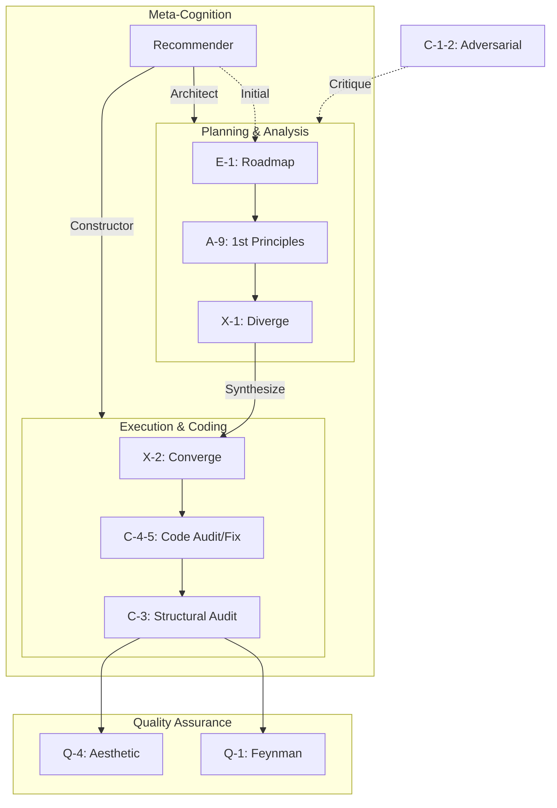

# Prompt Library

> 19 modules optimized for Antigravity. **52% average reduction.**

---

## Quick Start

Paste module content into chat. It executes against previous output.

### Recommended Pairs (Unified)

| Module | Modes |
|---|---|
| C-1-2 | audit → fix |
| C-4-5 | audit → fix |
| C-6-7 | audit → fix |

## Dependency Graph

---

## Modules

| ID | Name | Category |
|---|---|---|
| **C-1-2** | [Adversarial Review](file:///c:/Users/laihuip001/開発（太郎）/dev-rules/prompts/modules/C1C2-adversarial.md) | Critical |
| **C-3** | [Structural Audit](file:///c:/Users/laihuip001/開発（太郎）/dev-rules/prompts/modules/C3-structural_audit.md) | Critical |
| **C-4-5** | [Code Review](file:///c:/Users/laihuip001/開発（太郎）/dev-rules/prompts/modules/C4C5-code.md) | Critical |
| **C-6-7** | [Prompt Engineering](file:///c:/Users/laihuip001/開発（太郎）/dev-rules/prompts/modules/C6C7-prompt.md) | Critical |
| **Q-1** | [Feynman Filter](file:///c:/Users/laihuip001/開発（太郎）/dev-rules/prompts/modules/Q1-feynman_filter.md) | Quality |
| **Q-2** | [Second-Order Thinking](file:///c:/Users/laihuip001/開発（太郎）/dev-rules/prompts/modules/Q2-second_order_thinking.md) | Quality |
| **Q-3** | [Occam's Razor](file:///c:/Users/laihuip001/開発（太郎）/dev-rules/prompts/modules/Q3-occams_razor.md) | Quality |
| **Q-4** | [Aesthetic Audit](file:///c:/Users/laihuip001/開発（太郎）/dev-rules/prompts/modules/Q4-aesthetic_audit.md) | Quality |
| **A-2** | [Lateral Thinking](file:///c:/Users/laihuip001/開発（太郎）/dev-rules/prompts/modules/A2-lateral_thinking.md) | Analysis |
| **A-3** | [Bias Scanner](file:///c:/Users/laihuip001/開発（太郎）/dev-rules/prompts/modules/A3-bias_scanner.md) | Analysis |
| **A-7** | [Context Articulation](file:///c:/Users/laihuip001/開発（太郎）/dev-rules/prompts/modules/A7-context_articulation.md) | Analysis |
| **A-8** | [Morphological Matrix](file:///c:/Users/laihuip001/開発（太郎）/dev-rules/prompts/modules/A8-morphological_matrix.md) | Analysis |
| **A-9** | [First Principles](file:///c:/Users/laihuip001/開発（太郎）/dev-rules/prompts/modules/A9-first_principles.md) | Analysis |
| **B-3** | [Context Cartography](file:///c:/Users/laihuip001/開発（太郎）/dev-rules/prompts/modules/B3-context_cartography.md) | Execution |
| **E-1** | [Tactical Roadmap](file:///c:/Users/laihuip001/開発（太郎）/dev-rules/prompts/modules/E1-tactical_roadmap.md) | Execution |
| **I-1** | [Context Integration](file:///c:/Users/laihuip001/開発（太郎）/dev-rules/prompts/modules/I1-context_integration.md) | Execution |
| **M-1** | [Agent Command Compiler](file:///c:/Users/laihuip001/開発（太郎）/dev-rules/prompts/modules/M1-agent_command_compiler.md) | Execution |
| **R-1** | [Reverse Engineering](file:///c:/Users/laihuip001/開発（太郎）/dev-rules/prompts/modules/R1-reverse_engineering.md) | Execution |
| **X-1/2** | [Divergence & Convergence](file:///c:/Users/laihuip001/開発（太郎）/dev-rules/prompts/modules/X1X2-divergence_convergence.md) | Execution |
| **D-1** | [Design Review](file:///c:/Users/laihuip001/開発（太郎）/dev-rules/prompts/modules/D1-design_review.md) | Review |
| **Rec** | [Model Recommender](file:///c:/Users/laihuip001/開発（太郎）/dev-rules/prompts/modules/recommender.md) | Meta |

---

## System Instructions

| ID | Name |
|---|---|
| **SYS-cold-mirror** | [Cold Mirror](file:///c:/Users/laihuip001/開発（太郎）/dev-rules/prompts/system/cold_mirror.md) |
| **SYS-inquisitor** | [QA Inquisitor](file:///c:/Users/laihuip001/開発（太郎）/dev-rules/prompts/system/qa_inquisitor.md) |

---

## Optimization Protocol (v1.0)

- **Structural Unification**: Audit (監査) and Fix (修正) modules combined (e.g. C-4-5).
- **Aesthetic Flattening**: Replace XML deeply nested tags with Markdown to reduce tokens (~50% reduction).
- **Pre-Implementation Audit**: Always run C-3 (Structural Audit) before coding.
- **Native Invocation**: Optimize for copy-paste execution.
- **Portfolio-Ready**: Enforce `.gitignore` and `README.md` from Day 1.
