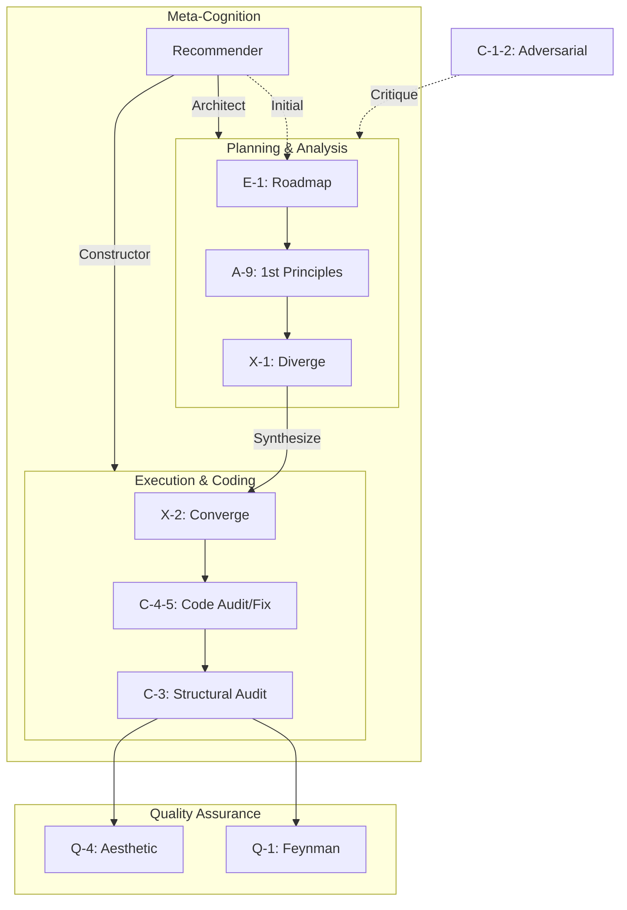

# Prompt Library

> 21 modules + 24 prompts optimized for Antigravity. **Termux-compatible.**

---

## Quick Start

Paste module content into chat. It executes against previous output.

### Recommended Pairs (Unified)

| Module | Modes |
|---|---|
| C-1-2 | audit → fix |
| C-4-5 | audit → fix |
| C-6-7 | audit → fix |

## Dependency Graph

---

## Core Modules (English)

| ID | Name | Category |
|---|---|---|
| **C-1-2** | [Adversarial Review](./modules/C1C2-adversarial.md) | Critical |
| **C-3** | [Structural Audit](./modules/C3-structural_audit.md) | Critical |
| **C-4-5** | [Code Review](./modules/C4C5-code.md) | Critical |
| **C-6-7** | [Prompt Engineering](./modules/C6C7-prompt.md) | Critical |
| **Q-1** | [Feynman Filter](./modules/Q1-feynman_filter.md) | Quality |
| **Q-2** | [Second-Order Thinking](./modules/Q2-second_order_thinking.md) | Quality |
| **Q-3** | [Occam's Razor](./modules/Q3-occams_razor.md) | Quality |
| **Q-4** | [Aesthetic Audit](./modules/Q4-aesthetic_audit.md) | Quality |
| **A-2** | [Lateral Thinking](./modules/A2-lateral_thinking.md) | Analysis |
| **A-3** | [Bias Scanner](./modules/A3-bias_scanner.md) | Analysis |
| **A-7** | [Context Articulation](./modules/A7-context_articulation.md) | Analysis |
| **A-8** | [Morphological Matrix](./modules/A8-morphological_matrix.md) | Analysis |
| **A-9** | [First Principles](./modules/A9-first_principles.md) | Analysis |
| **B-3** | [Context Cartography](./modules/B3-context_cartography.md) | Execution |
| **E-1** | [Tactical Roadmap](./modules/E1-tactical_roadmap.md) | Execution |
| **I-1** | [Context Integration](./modules/I1-context_integration.md) | Execution |
| **M-1** | [Agent Command Compiler](./modules/M1-agent_command_compiler.md) | Execution |
| **R-1** | [Reverse Engineering](./modules/R1-reverse_engineering.md) | Execution |
| **X-1/2** | [Divergence & Convergence](./modules/X1X2-divergence_convergence.md) | Execution |
| **D-1** | [Design Review](./modules/D1-design_review.md) | Review |
| **Rec** | [Model Recommender](./modules/recommender.md) | Meta |

---

## Japanese Prompts (日本語プロンプト)

| Name | File | Category |
|---|---|---|
| WBSスケジューリング | [WBSスケジューリング.md](./WBSスケジューリング.md) | Planning |
| エレガンススマート監査 | [エレガンススマート監査.md](./エレガンススマート監査.md) | Audit |
| オッカムのカミソリ | [オッカムのカミソリ.md](./オッカムのカミソリ.md) | Quality |
| コンテキストの言語化 | [コンテキストの言語化.md](./コンテキストの言語化.md) | Analysis |
| コンテキスト構造化 | [コンテキスト構造化.md](./コンテキスト構造化.md) | Analysis |
| コーディング仕様書コンパイル | [コーディング仕様書コンパイル.md](./コーディング仕様書コンパイル.md) | Execution |
| コード外科手術（凹） | [コード外科手術凹.md](./コード外科手術凹.md) | Critical |
| コード監査（凸） | [コード監査凸.md](./コード監査凸.md) | Critical |
| システム構造監査 | [システム構造監査.md](./システム構造監査.md) | Audit |
| プロンプト外科手術（凹） | [プロンプト外科手術凹.md](./プロンプト外科手術凹.md) | Critical |
| プロンプト構造監査（凸） | [プロンプト構造監査凸.md](./プロンプト構造監査凸.md) | Critical |
| リバースエンジニアリング | [リバースエンジニアリング.md](./リバースエンジニアリング.md) | Analysis |
| 二次影響予測 | [二次影響予測.md](./二次影響予測.md) | Quality |
| 単純性原理と平易な説明 | [単純性原理と平易な説明.md](./単純性原理と平易な説明.md) | Quality |
| 外科的再構築（凹） | [外科的再構築凹.md](./外科的再構築凹.md) | Critical |
| 外部文脈の結合 | [外部文脈の結合.md](./外部文脈の結合.md) | Analysis |
| 多角的ラテラル・シンキング | [多角的ラテラル・シンキング.md](./多角的ラテラル・シンキング.md) | Analysis |
| 形態素解析マトリクス | [形態素解析マトリクス.md](./形態素解析マトリクス.md) | Analysis |
| 敵対的レビュー（凸） | [敵対的レビュー凸.md](./敵対的レビュー凸.md) | Critical |
| 未踏の改善点 | [未踏の改善点.md](./未踏の改善点.md) | Quality |
| 発散と収束 | [発散と収束.md](./発散と収束.md) | Execution |
| 第一原理思考 | [第一原理思考.md](./第一原理思考.md) | Analysis |

---

## System Instructions

| ID | Name |
|---|---|
| **SYS-cold-mirror** | [Cold Mirror](./system/cold_mirror.md) |
| **SYS-inquisitor** | [QA Inquisitor](./system/qa_inquisitor.md) |

---

## Optimization Protocol (v1.1)

- **Structural Unification**: Audit (監査) and Fix (修正) modules combined (e.g. C-4-5).
- **Aesthetic Flattening**: Replace XML deeply nested tags with Markdown to reduce tokens (~50% reduction).
- **Pre-Implementation Audit**: Always run C-3 (Structural Audit) before coding.
- **Native Invocation**: Optimize for copy-paste execution.
- **Portfolio-Ready**: Enforce `.gitignore` and `README.md` from Day 1.
- **Relative Paths**: Use `./` relative paths for portability across environments.
